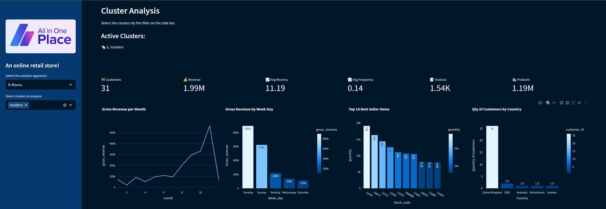
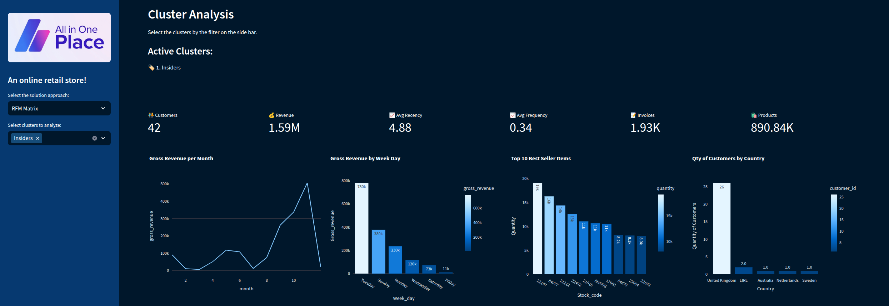

# LOYALTY PROGRAM WITH CLUSTERING

**Disclaimer**: This project was developed based on this [Kaggle Competition](https://www.kaggle.com/datasets/carrie1/ecommerce-data). Aiming to implement a RFM Matrix and also, 
to work with non-supervised machine learning models.

# 1. Business Scenario

 All in one place is an online retail store that sells second-hand products from various brands at lower prices. With just over a year of operation, 
the marketing team noticed that some customers from their base purchase more expensive products more frequently, contributing significantly to the company's revenue.

Based on this insight, the marketing team decided to launch a loyalty program for the top customers in their base, named Insiders.
Moreover, the Marketing teams lacks the necessary knowledge to identify the customers to join the program. As a result, this task have been assigned to the company's data team,
whose should develop a solution and a report to respond the marketing queries below.
* Who are the eligible individuals to participate in the program?
* How many customers will be part of the group?
* What are the main characteristics of these customers?
* What percentage of the revenue comes from the selected group?

# 2. Solution Strategy

 The solution was developed based on the <b>CRISP-DM</b> (Cross-Industry Standard Process for Data Mining), which is a cyclic method of development. 

To sort this business problem, were followed the below approach:
* One notebook for the [Exploratory Data Analysis](https://github.com/RPerottoni/Loyalty_Program_with_Clustering/blob/main/notebooks/c01_rp_eda.ipynb), Please note that, due to the file size, it was not possible to include it along with the graphs.
However, you should be able to reproduce everything on your system.
* One notebook for the [RFM Matrix](https://github.com/RPerottoni/Loyalty_Program_with_Clustering/blob/main/notebooks/c01_rp_RFM.ipynb)
* One notebook for the [Machine Learning Models](https://github.com/RPerottoni/Loyalty_Program_with_Clustering/blob/main/notebooks/c01_rp_ml.ipynb)

To reproduce the project on your system, please follow the steps below:

- Clone the repository to your computer.
- Create and activate a new virtual environment.
- Install the required libraries by running: **pip install -r requirements.txt**

After completing these steps, you should be able to successfully reproduce the project on your machine.

## 2.1 Data Processing

The data was received in a .csv format, so it was simply loaded into the notebook.

I then started by:

- Renaming columns to follow the snake_case pattern;
- Checking the size of the dataset;
- Identifying and handling NaN values;
- Verifying and adjusting data types;
- Identifying and handling duplicate records.

The dataset used in this project consists of 541,909 records and 8 columns, which are described in the table below.

| Variable Name | Role     | Type        | Description                                                                 | Units     | Missing Values |
|---------------|----------|-------------|-----------------------------------------------------------------------------|-----------|----------------|
| InvoiceNo     | ID       | Categorical | a 6-digit integral number uniquely assigned to each transaction. If this code starts with letter 'c', it indicates a cancellation |           | no             |
| StockCode     | ID       | Categorical | a 5-digit integral number uniquely assigned to each distinct product          |           | no             |
| Description   | Feature  | Categorical | product name                                                                |           | no             |
| Quantity      | Feature  | Integer     | the quantities of each product (item) per transaction                        |           | no             |
| InvoiceDate   | Feature  | Date        | the day and time when each transaction was generated                         |           | no             |
| UnitPrice     | Feature  | Continuous  | product price per unit                                                      | sterling  | no             |
| CustomerID    | Feature  | Categorical | a 5-digit integral number uniquely assigned to each customer                 |           | no             |
| Country       | Feature  | Categorical | the name of the country where each customer resides                          |           | no             |

## 2.2  Exploratory Data analysis

Thereafter, I conducted an exploratory data analysis to gain an overview of the dataset. The exploratory data analysis provided several valuable insights:

- **NaN Values**: There are 135080 customers without identification among the registers. It corresponds to 25% of the total of the registers and these, unfortunatly needs to be removed from the analysis, once it won't be possible to contact them in case they are selected for the program.
- **Duplicated registers**: There are 5225 duplicated registers on the data set and these will be removed from the analysis.
- **Quantity**: Negative values that correspond to orders that have been cancelled. These will removed from the analysis as well as the original purchase that originate the cancelation.
- **Unit Price**: Items with price equal to 0 will be removed from the analysis, once this information will be used to calculate the revenue. And some high value will be further investigate, to understant if they are legit.
- **Stock Code**: There are some sort of codes that do not reffers to a products and will be removed from the analysis.

Approximately 30% of the records were removed from the analysis due to missing or erroneous information. This represents a significant volume of data that had been collected but only served to consume resources unnecessarily. These issues must be addressed to ensure data quality.

## 2.3 Feature Engineering

In this step, I created additional features to obtain more detailed and accurate information about the customers. The features and the process of their creation are described below.

- **Gross Revenue**: by multipling the quantity sold per unit price;
- **Recency**: by subtracting the most recent date present into the data set per the last purchase date of each customer;
- **Qty of invoices**: the number of invoices issues per customer;
- **Qty of produtcs**: the number of units of products purchased per customer;
- **Range of products**: the number of unique products purchased by customer;
- **Avg ticket value**: the amount each custoer spent, in average;
- **Frequency**: quantity of purchases during a period of time;
- **Qty avg of products**: Sum of quantity of items purchased divided by the number of purchases made;
- **Week day most frequent by customer**: Based on the date, extract the week day and calculate the mode by customer;
- **Month mos frequent by customer**; Based on the date, extract the month  and calculate the mode by customer;
- **Year week most frequent by customer**; Based on the date, extract the year week and calculate the mode by customer;

## 2.4 Approaches for Customer Segmentation

I have developed this project using two different approaches.

### 2.4.1 RFM Matrix

The entire project development and calculation of the RFM Matrix are explained in my Medium post.

You can find a detailed explanation in my Medium post at the link below.
https://medium.com/@perottoni.ricardo/rfm-analysis-applied-to-a-customer-segmentation-ada20d8e046e

### 2.4.2 K-Means

The entire project development and the machine learning application is explained in my post on medium.

You can find a detailed explanation in my Medium post at the link below.
https://medium.com/@perottoni.ricardo/customer-segmentation-with-machine-learning-algorithm-5e6c3328bbeb

# 3 - Results

I have built a interactive dashboard that can be accessed following the link below.

https://rp00mlclustering.streamlit.app/

I have successfully solved the business problem with both tools: **RFM Matrix** and also by applying **Machine Learning**.

While the result with Machine Learning is more accurate, the RFM Matrix is still very powerful due to its simplicity.

## 3.1 - K-Means

By applying K-Means, I have successfully identified 31 customers to join the **Insiders** program. These 31 customers represents more than 20% of the companys annual revenue and they also bought a huge quantity of products.

## 3.2 - RFM Matrix

The RFM Matrix is a much simpler tool compared to Machine Learning. However, by analyzing its results, we can conclude that, despite its simplicity, it is still capable of delivering strong results. Where applying it, I have successfully identified 42 customers, that represents also around 20% of the company revenue.

# 4 - Conclusions

I have successfully selected the customers to join the **Insiders** program either with RFM Matrix or K-Means.

By applying K-Means, I got a more accurate result but the RFM also had a good performance and does not require advanced knowledge, what is an advantage.

Besides that, both tools allowed us to group customers into various segments, providing valuable insights and numerous opportunities for improvement, such as:

*  The company can identify and target potential customers to increase their purchases.
* The company can optimize strategies for best-selling and low-performing items.
* The company can determine the best timing for promotions and analyze business seasonality in depth.
* New project opportunities can be identified to further increase revenue.
* The possibilities for leveraging this information are only limited by creativity.

# 5. Technologies

# AUTHOR

### Ricardo Perottoni

