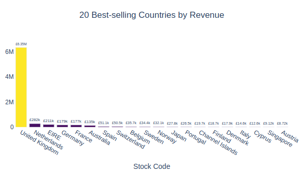

# LOYALTY PROGRAM WITH CLUSTERING

🚀 **Disclaimer**: This project was developed based on this [Kaggle Competition](https://www.kaggle.com/datasets/carrie1/ecommerce-data). The goal was to implement an RFM Matrix and work with unsupervised machine learning models.

## 📌 Table of Contents
- [1. Business Scenario](#1-business-scenario)
- [2. Solution Strategy](#2-solution-strategy)
  - [2.1 Data Processing](#21-data-processing)
  - [2.2 Exploratory Data Analysis](#22-exploratory-data-analysis)
  - [2.3 Feature Engineering](#23-feature-engineering)
  - [2.4 Customer Segmentation Approaches](#24-customer-segmentation-approaches)
- [3. Results](#3-results)
  - [3.1 K-Means Clustering](#31-customer-segmentation-with-k-means)
  - [3.2 RFM Matrix](#32-customer-segmentation-with-rfm-matrix)
  - [3.3 Actionable Insights](#33-actionable-insights)
- [4. Conclusions](#4-conclusions)
- [5. Technologies](#5-technologies)
- [6. Author](#6-author)

---

## 1. 🎯 Business Scenario

🛒 **All in One Place** is an online retail store that sells second-hand products from various brands at lower prices. After a year of operation, the marketing team noticed that some customers purchase expensive products frequently, significantly contributing to revenue.

To capitalize on this insight, the team decided to launch a loyalty program, **Insiders**, for their top customers. However, they lack the expertise to identify the right participants. Thus, the data team was tasked with developing a solution to answer these key questions:

✅ Who are the eligible customers for the program?  
✅ How many customers should be included?  
✅ What are the key characteristics of these customers?  
✅ What percentage of revenue comes from this group?  

## 2. 🔍 Solution Strategy

The solution follows the **CRISP-DM** methodology (Cross-Industry Standard Process for Data Mining), a structured approach to data science projects.

📌 **Implementation Notebooks:**  
- 📊 [EDA](https://github.com/RPerottoni/Loyalty_Program_with_Clustering/blob/main/notebooks/c01_rp_eda.ipynb)  
- 📈 [RFM Matrix](https://github.com/RPerottoni/Loyalty_Program_with_Clustering/blob/main/notebooks/c01_rp_RFM.ipynb)  
- 🤖 [K-Means Clustering](https://github.com/RPerottoni/Loyalty_Program_with_Clustering/blob/main/notebooks/c01_rp_ml.ipynb)  

🛠️ **How to Reproduce:**
```bash
git clone https://github.com/RPerottoni/Loyalty_Program_with_Clustering.git
pip install -r requirements.txt
```

### 2.1 📂 Data Processing

The dataset was received in `.csv` format and loaded into a notebook. Key preprocessing steps included:

✅ Renaming columns to snake_case format.  
✅ Handling missing values (e.g., removing 25% of records with no customer ID).  
✅ Removing duplicate records (~5,225 duplicates).  
✅ Filtering out invalid values (e.g., negative quantities, zero prices, non-product stock codes).  

📊 **Dataset Overview:**
| Column       | Type        | Description |
|-------------|------------|-------------|
| InvoiceNo   | Categorical | Unique ID for transactions (if starting with 'C', indicates cancellation). |
| StockCode   | Categorical | Unique product identifier. |
| Description | Categorical | Product name. |
| Quantity    | Integer     | Quantity per transaction. |
| InvoiceDate | Date        | Transaction timestamp. |
| UnitPrice   | Continuous  | Product price per unit. |
| CustomerID  | Categorical | Unique customer identifier. |
| Country     | Categorical | Customer's country. |

### 2.2 🔬 Exploratory Data Analysis

Key findings from EDA:

✅ **25% missing customer IDs** → Removed.  
✅ **5,225 duplicated entries** → Removed.  
✅ **Negative order quantities** (cancellations) → Removed original purchases & cancellations.  
✅ **Unit price = 0** → Removed.  
✅ **Non-product stock codes** → Removed.  

### 2.3 🛠 Feature Engineering

Additional features were created for better customer insights:

✅ **Gross Revenue** = Quantity × Unit Price  
✅ **Recency** = Days since last purchase  
✅ **Purchase Frequency** = Total invoices per customer  
✅ **Product Variety** = Unique products purchased  
✅ **Average Ticket Size** = Avg. amount spent per order  
✅ **Most Frequent Purchase Day** (weekday/month/week of the year)  

### 2.4 🏷 Customer Segmentation Approaches

Two approaches were used for customer segmentation:

📖 **[RFM Matrix](https://medium.com/@perottoni.ricardo/rfm-analysis-applied-to-a-customer-segmentation-ada20d8e046e)**  
📖 **[K-Means Clustering](https://medium.com/@perottoni.ricardo/customer-segmentation-with-machine-learning-algorithm-5e6c3328bbeb)**  

## 3. 📊 Results

### 3.1 🤖 Customer Segmentation with K-Means

Using K-Means, customers were segmented into **22 groups**. This number was optimized based on **silhouette score**.  
🖼 **Visualization:** 

### 3.2 🏆 Customer Segmentation with RFM Matrix

With the RFM Matrix, customers were grouped into **10 categories**, achieving a **simpler yet effective segmentation**.  
🖼 **Visualization:** 

### 3.3 📈 Actionable Insights

#### 🔥 Best & Worst-Selling Items
 
✅ Optimize stock levels & avoid overstock.  
✅ Improve marketing campaigns.  
✅ Enhance product recommendations.  

#### 🌍 Top Performing Countries
 

✅ Focus marketing in high-revenue countries.  
✅ Expand in similar markets.  

#### 📅 Seasonality Trends
 

✅ Plan promotions based on seasonality.  
✅ Optimize inventory and staffing.  

## 4. 📌 Conclusions

🏆 **Key Takeaways:**
- K-Means provided more **granular insights**, while RFM was **simpler & interpretable**.  
- The loyalty program **Insiders** can now be effectively targeted.  
- Actionable insights include **optimized stock, marketing strategies, and customer engagement**.  

## 5. 🛠 Technologies

[](https://www.python.org/)
[](https://jupyter.org/)
[](https://numpy.org/)
[](https://pandas.pydata.org/)
[](https://scikit-learn.org/)
[](https://streamlit.io/)
[](https://plotly.com/)


## 6. 👨‍💻 Author

**Ricardo Perottoni**
📧 Contact: [LinkedIn](https://www.linkedin.com/in/ricardoperottoni/)  
🚀 Happy Coding! 😊
