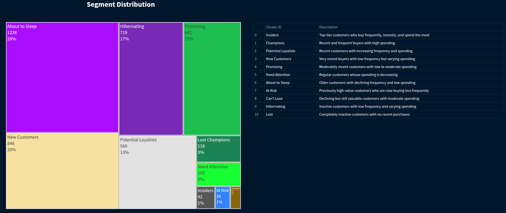

# LOYALTY PROGRAM WITH CLUSTERING

**Disclaimer**: This project was developed based on this [Kaggle Competition](https://www.kaggle.com/datasets/carrie1/ecommerce-data). Aiming to implement a RFM Matrix and also, 
to work with non-supervised machine learning models.

# 1. Business Scenario

 All in one place is an online retail store that sells second-hand products from various brands at lower prices. With just over a year of operation, 
the marketing team noticed that some customers from their base purchase more expensive products more frequently, contributing significantly to the company's revenue.

Based on this insight, the marketing team decided to launch a loyalty program for the top customers in their base, named Insiders.
Moreover, the Marketing teams lacks the necessary knowledge to identify the customers to join the program. As a result, this task have been assigned to the company's data team,
whose should develop a solution and a report to respond the marketing queries below.
* Who are the eligible individuals to participate in the program?
* How many customers will be part of the group?
* What are the main characteristics of these customers?
* What percentage of the revenue comes from the selected group?

# 2. Solution Strategy

 The solution was developed based on the <b>CRISP-DM</b> (Cross-Industry Standard Process for Data Mining), which is a cyclic method of development. 

To sort this business problem, were followed the below approach:
* One notebook for the [Exploratory Data Analysis](https://github.com/RPerottoni/Loyalty_Program_with_Clustering/blob/main/notebooks/c01_rp_eda.ipynb), Please note that, due to the file size, it was not possible to include it along with the graphs.
However, you should be able to reproduce everything on your system.
* One notebook for the [RFM Matrix](https://github.com/RPerottoni/Loyalty_Program_with_Clustering/blob/main/notebooks/c01_rp_RFM.ipynb)
* One notebook for the [Machine Learning Models](https://github.com/RPerottoni/Loyalty_Program_with_Clustering/blob/main/notebooks/c01_rp_ml.ipynb)

To reproduce the project on your system, please follow the steps below:

- Clone the repository to your computer.
- Create and activate a new virtual environment.
- Install the required libraries by running: **pip install -r requirements.txt**

After completing these steps, you should be able to successfully reproduce the project on your machine.

## 2.1 Data Processing

The data was received in a .csv format, so it was simply loaded into the notebook.

I then started by:

- Renaming columns to follow the snake_case pattern;
- Checking the size of the dataset;
- Identifying and handling NaN values;
- Verifying and adjusting data types;
- Identifying and handling duplicate records.

The dataset used in this project consists of 541,909 records and 8 columns, which are described in the table below.

| Variable Name | Role     | Type        | Description                                                                 | Units     | Missing Values |
|---------------|----------|-------------|-----------------------------------------------------------------------------|-----------|----------------|
| InvoiceNo     | ID       | Categorical | a 6-digit integral number uniquely assigned to each transaction. If this code starts with letter 'c', it indicates a cancellation |           | no             |
| StockCode     | ID       | Categorical | a 5-digit integral number uniquely assigned to each distinct product          |           | no             |
| Description   | Feature  | Categorical | product name                                                                |           | no             |
| Quantity      | Feature  | Integer     | the quantities of each product (item) per transaction                        |           | no             |
| InvoiceDate   | Feature  | Date        | the day and time when each transaction was generated                         |           | no             |
| UnitPrice     | Feature  | Continuous  | product price per unit                                                      | sterling  | no             |
| CustomerID    | Feature  | Categorical | a 5-digit integral number uniquely assigned to each customer                 |           | no             |
| Country       | Feature  | Categorical | the name of the country where each customer resides                          |           | no             |

## 2.2  Exploratory Data analysis

Thereafter, I conducted an exploratory data analysis to gain an overview of the dataset. The exploratory data analysis provided several valuable insights:

- **NaN Values**: There are 135080 customers without identification among the registers. It corresponds to 25% of the total of the registers and these, unfortunatly needs to be removed from the analysis, once it won't be possible to contact them in case they are selected for the program.
- **Duplicated registers**: There are 5225 duplicated registers on the data set and these will be removed from the analysis.
- **Quantity**: Negative values that correspond to orders that have been cancelled. These will removed from the analysis as well as the original purchase that originate the cancelation.
- **Unit Price**: Items with price equal to 0 will be removed from the analysis, once this information will be used to calculate the revenue. And some high value will be further investigate, to understant if they are legit.
- **Stock Code**: There are some sort of codes that do not reffers to a products and will be removed from the analysis.

Approximately 30% of the records were removed from the analysis due to missing or erroneous information. This represents a significant volume of data that had been collected but only served to consume resources unnecessarily. These issues must be addressed to ensure data quality.

## 2.3 Feature Engineering

In this step, I created additional features to obtain more detailed and accurate information about the customers. The features and the process of their creation are described below.

- **Gross Revenue**: by multipling the quantity sold per unit price;
- **Recency**: by subtracting the most recent date present into the data set per the last purchase date of each customer;
- **Qty of invoices**: the number of invoices issues per customer;
- **Qty of produtcs**: the number of units of products purchased per customer;
- **Range of products**: the number of unique products purchased by customer;
- **Avg ticket value**: the amount each custoer spent, in average;
- **Frequency**: quantity of purchases during a period of time;
- **Qty avg of products**: Sum of quantity of items purchased divided by the number of purchases made;
- **Week day most frequent by customer**: Based on the date, extract the week day and calculate the mode by customer;
- **Month mos frequent by customer**; Based on the date, extract the month  and calculate the mode by customer;
- **Year week most frequent by customer**; Based on the date, extract the year week and calculate the mode by customer;

## 2.4 Calculus of RFM Matrix

The RFM Matrix is calculated by given scores to each customer, based into their performance while analysing the following characteristics:

- **Recency**: the lower the better. 
- **Frequency** : the higher the better.
- **Monetary**: the higher the better.

I have assigned scores from 1 to 5 using a pandas function called 'qcut.' This function divides the data into specified quantiles (equal-sized intervals), sorting the values 
in ascending order, and then assigns labels based on the quantile each value falls into.
And thereafter, a new column named as RFM Score will be created, and I am going to concatenate the calculated scores for recency, frequency and monetary to define the 
final score for each customer.

With all calculations finished, it is time to allocate each customer into a group, according to its final score.
The segments to allocate the customers would be:

- **Champions**: If the scores for recency falls into 4 or 5 , frequency falls into 4 or 5 and monetary is equal to 5;
- **Loyal Customers**: If the recency score falls between 4 or 5, frequency falls between 4 or 5, and monetary falls between 4 or 5.
- **Potential Loyalists**: If the recency score falls between 4 or 5, frequency falls between 3 or 5, and monetary falls between 3 or 5.
- **New Customers**: If the recency score falls between 4 or 5, frequency falls between 1 or 2, and monetary falls between 1 or 5.
- **Promising**: If the recency score falls between 3 or 5, frequency falls between 2 or 5, and monetary falls between 1 or 3.
- **Need Attention**: If the recency score falls between 3 or 5, frequency falls between 3 or 5, and monetary falls between 4 or 5.
- **About to Sleep**: If the recency score falls between 1 or 3, frequency falls between 2 or 5, and monetary falls between 1 or 3.
- **At Risk**: If the recency score falls between 2 or 3, frequency falls between 4 or 5, and monetary falls between 4 or 5.
- **Can't Lose**: If the recency score falls between 1 or 2, frequency falls between 3 or 5, and monetary falls between 3 or 5.
- **Hibernating**: If the recency score falls between 1 or 3, frequency falls between 1 or 3, and monetary falls between 1 or 5.
- **Lost**: If the recency, frequency, and monetary scores are all equal to 1.

After the calculations, all customers have been assigned to their respective groups, and the results are displayed in the images below.

# 3 - Conclusions

The solution has been developed using a tool called the RFM Matrix, which has been instrumental in addressing this business problem. It has enabled the identification of the group of customers eligible to join the Insider Program and has also highlighted areas for improvement that the company can address to increase its revenue.

### Characteristics of the Insider Group

The Insider Group consists of customers selected to participate in the campaign. These customers are classified as Champions within the project. This group comprises 42 customers, representing approximately 1% of the total customer base. Despite its small size, this group accounts for 20% of the gross revenue and purchases significantly more products than any other group.

With these insights, the company can design a highly personalized program for these customers, enhancing their satisfaction and motivating them to continue shopping with us.

# 4 - Next Steps

The next step is to provide a solution using machine learning models. Once completed, this README will be updated to include the results of the machine learning approach and a comparison between the two methods.

